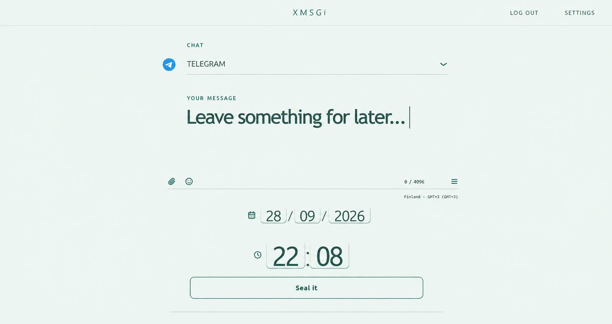
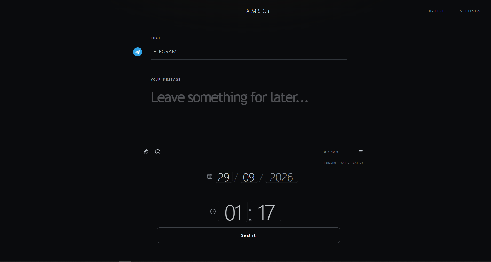
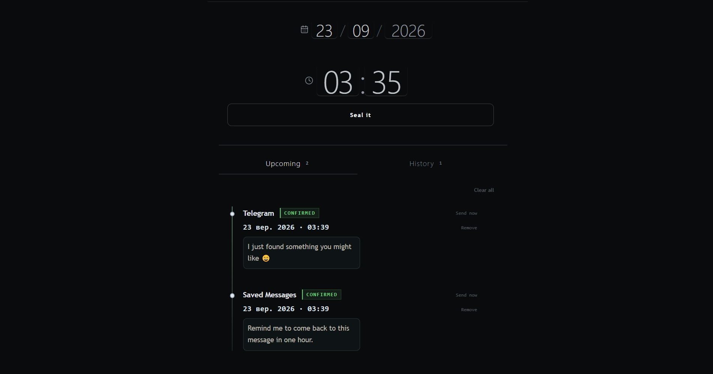
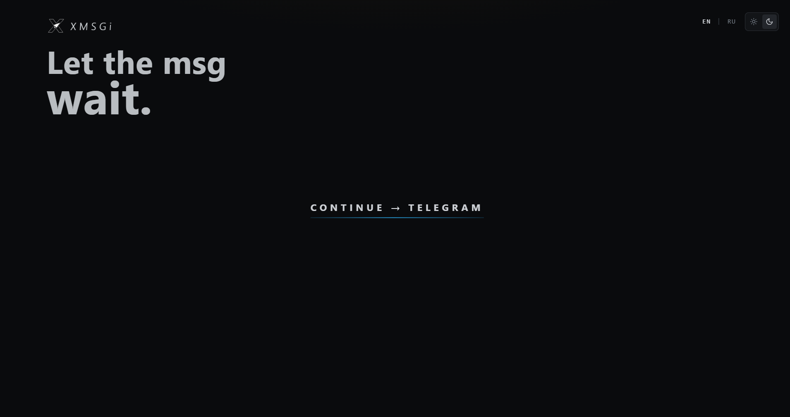

# XMSGi
**Telegram message scheduler for Windows, Linux, and macOS.**

XMSGi is a lightweight desktop application for sending and scheduling Telegram messages using your personal Telegram account.

## Features

- Telegram chat selection
- Instant message sending
- Scheduled message sending
- Session saving
- Session deletion
- Windows Portable application
- Linux AppImage and `.deb`
- macOS DMG

## Download

**XMSGi 2.2.3** is available for Windows, Linux, and macOS.

### Windows

Portable `.exe` — no installation required.

### Linux

AppImage and Debian `.deb` packages.

### macOS

DMG package.

**[Download XMSGi 2.2.3 from GitHub Releases](https://github.com/molodoy01/XMSGi/releases/tag/v2.2.3)**

## Screenshots

## Privacy & Security

Telegram session data is stored locally and protected using Electron's secure storage where supported.

XMSGi does not require a Telegram bot for its core scheduling flow.

## Open Source

XMSGi is open source and available on GitHub.
